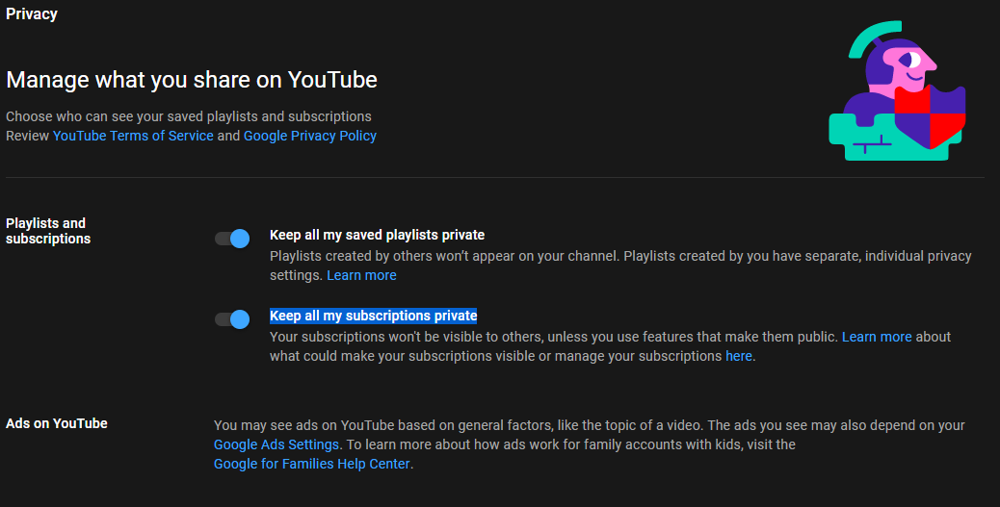
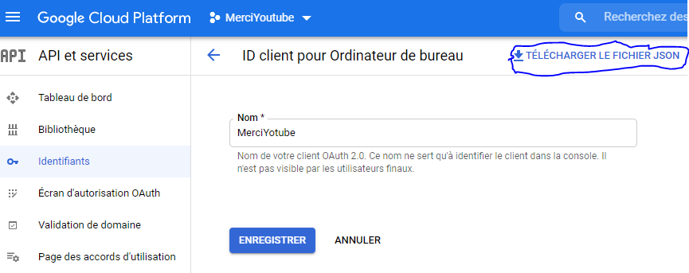

# MerciYouTube

This project was created to thanks automatically each subscribers of my YouTube channel [Admandev](https://www.youtube.com/c/ADMANDev).

> Note : "Merci YouTube" means "Thanks YouTube" in french.

---

This C# program will get subscribers list of the channel with the [YouTube V3 API](https://developers.google.com/youtube/v3/) and a speech synthesizer will says "Merci [subscriber name]" to all subscribers in the list.

---

| WARNING: Program will get only subscribers that unchecked "Keep all my subscriptions private" on privacy page. |
| --- |

## To use MerciYouTube

---

* You have to generate a [YouTube V3 API](https://developers.google.com/youtube/v3/) key and download auth.json file that contains API client key. <u>Save it on the same .exe folder.</u>

* In [MainWindow.xaml.cs](MerciYoutube/MainWindow.xaml.cs), replace "channelName" variable content by your own channel name.

* Thank you.